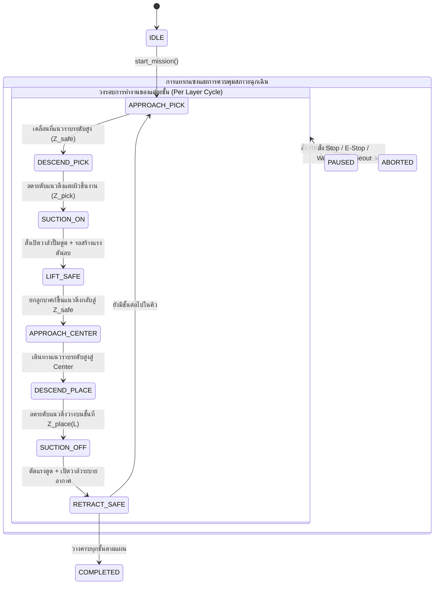
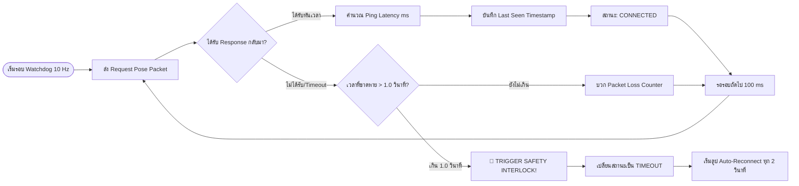
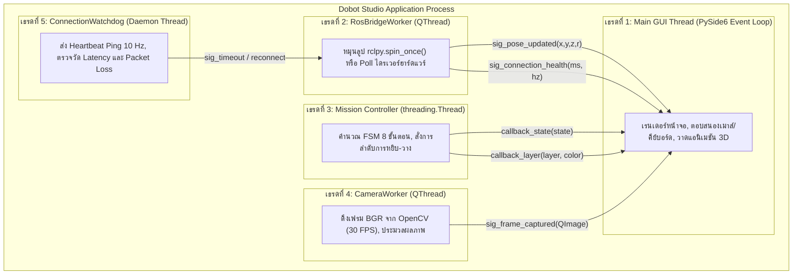
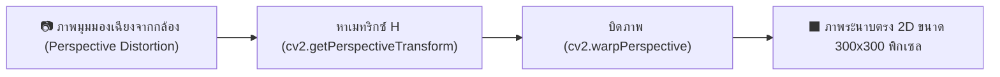
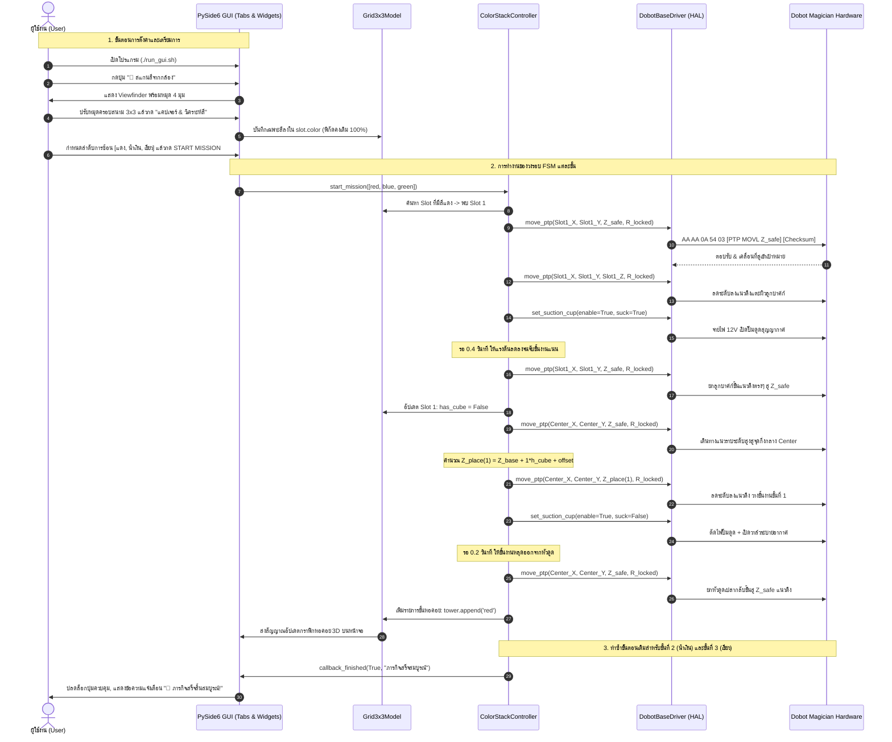

# 📘 เอกสารหลักการทำงานและสถาปัตยกรรมระบบโดยละเอียด
## Dobot 4-DOF Pick & Place & Color Stacking Studio (ROS 2)

เอกสารฉบับนี้อธิบายหลักการทำงานและสถาปัตยกรรมทางวิศวกรรมโดยละเอียดที่สุดของระบบควบคุมแขนกล **Dobot 4-DOF สำหรับภารกิจ Pick & Place ซ้อนลูกบาศก์เป็นหอคอยบนสนามตาราง 3x3 ตามลำดับสี** ครอบคลุมตั้งแต่หลักการทางคณิตศาสตร์และจลนศาสตร์ (Forward & Inverse Kinematics), สถาปัตยกรรมซอฟต์แวร์แบบแยกชั้น (Layered Modular Architecture), โปรโตคอลการสื่อสารระดับไบต์ (Byte-level Serial Protocol), ระบบความปลอดภัยและ Watchdog ตรวจวัด Latency, Finite State Machine (FSM), การประมวลผลภาพคอมพิวเตอร์วิทัศน์ (Homography Perspective Warping & HSV Color Segmentation), และการเชื่อมต่อแบบไฮบริดร่วมกับระบบปฏิบัติการหุ่นยนต์ **ROS 2**

---

## 📑 สารบัญ (Table of Contents)

1. [ภาพรวมระบบและปรัชญาการออกแบบ (System Overview & Design Philosophy)](#1-ภาพรวมระบบและปรัชญาการออกแบบ)
2. [สถาปัตยกรรมซอฟต์แวร์แบบแยกชั้น (Layered Modular Architecture)](#2-สถาปัตยกรรมซอฟต์แวร์แบบแยกชั้น)
3. [หลักการทางจลนศาสตร์และโครงสร้างกลไกหุ่นยนต์ (Kinematics & Robot Mechanics)](#3-หลักการทางจลนศาสตร์และโครงสร้างกลไกหุ่นยนต์)
   - 3.1 [กลไกข้อต่อขนาน (Parallelogram Linkage Mechanical Decoupling)](#31-กลไกข้อต่อขนาน-parallelogram-linkage)
   - 3.2 [พารามิเตอร์เชิงเรขาคณิต (Geometric Parameters)](#32-พารามิเตอร์เชิงเรขาคณิต)
   - 3.3 [จลนศาสตร์ทางตรง (Forward Kinematics: FK)](#33-จลนศาสตร์ทางตรง-forward-kinematics)
   - 3.4 [จลนศาสตร์ผกผัน (Inverse Kinematics: IK)](#34-จลนศาสตร์ผกผัน-inverse-kinematics)
   - 3.5 [ขอบเขตพื้นที่ทำงานและ Singularity (Workspace Envelope & Singularities)](#35-ขอบเขตพื้นที่ทำงานและ-singularity)
4. [หลักการโมเดลคณิตศาสตร์สนามตาราง 3x3 (Grid 3x3 Model & Stacking Math)](#4-หลักการโมเดลคณิตศาสตร์สนามตาราง-3x3)
   - 4.1 [ผังพิกัดและบทบาทของแต่ละช่องบนกระดาน](#41-ผังพิกัดและบทบาทของแต่ละช่องบนกระดาน)
   - 4.2 [สมการคำนวณระดับความสูงการวางซ้อน ($Z_{\text{place}}$)](#42-สมการคำนวณระดับความสูงการวางซ้อน-z_textplace)
   - 4.3 [การคำนวณเพดานบินปลอดภัยแบบพลวัต ($Z_{\text{safe}}$ Dynamic Ceiling)](#43-การคำนวณเพดานบินปลอดภัยแบบพลวัต-z_textsafe)
   - 4.4 [กลไกการล็อกแกนหมุนหัวดูด ($R$-Axis Invariant Lock)](#44-กลไกการล็อกแกนหมุนหัวดูด-r-axis-lock)
5. [หลักการทำงานของ Finite State Machine (FSM Motion Controller)](#5-หลักการทำงานของ-finite-state-machine)
   - 5.1 [วงรอบ State Machine 8 ขั้นตอนมาตรฐาน](#51-วงรอบ-state-machine-8-ขั้นตอนมาตรฐาน)
   - 5.2 [กลไก Trajectory และการควบคุมการยก-ลดระดับแนวดิ่ง](#52-กลไก-trajectory-และการควบคุมการยก-ลดระดับแนวดิ่ง)
   - 5.3 [ระบบการแทรกแซงและการควบคุมสภาวะขัดจังหวะ (Pause / Resume / E-Stop)](#53-ระบบการแทรกแซงและการควบคุมสภาวะขัดจังหวะ)
6. [หลักการสื่อสารฮาร์ดแวร์และโปรโตคอล Serial (Hardware Driver & Serial Protocol)](#6-หลักการสื่อสารฮาร์ดแวร์และโปรโตคอล-serial)
   - 6.1 [โครงสร้างแพ็กเก็ตโปรโตคอล Dobot Magician (v1.1.x)](#61-โครงสร้างแพ็กเก็ตโปรโตคอล-dobot-magician-v11x)
   - 6.2 [อัลกอริทึมคำนวณ Checksum ระดับไบต์](#62-อัลกอริทึมคำนวณ-checksum-ระดับไบต์)
   - 6.3 [กลไกยืนยันการเคลื่อนที่ลู่เข้าสู่เป้าหมาย (`wait_until_reached`)](#63-กลไกยืนยันการเคลื่อนที่ลู่เข้าสู่เป้าหมาย)
   - 6.4 [สถาปัตยกรรม Hardware Abstraction Layer (HAL) และการเปรียบเทียบ 4 โหมดไดรเวอร์](#64-สถาปัตยกรรม-hardware-abstraction-layer-hal)
7. [หลักการระบบตรวจสอบสุขภาพและความปลอดภัย (Connection Watchdog & Safety Interlock)](#7-หลักการระบบตรวจสอบสุขภาพและความปลอดภัย)
   - 7.1 [วงรอบ Heartbeat และการตรวจวัด Latency (10 Hz)](#71-วงรอบ-heartbeat-และการตรวจวัด-latency)
   - 7.2 [กลไกตัดการทำงานฉุกเฉิน (Safety Interlock Trigger)](#72-กลไกตัดการทำงานฉุกเฉิน)
   - 7.3 [วงรอบการพยายามเชื่อมต่อใหม่อัตโนมัติ (Auto-Reconnect Loop)](#73-วงรอบการพยายามเชื่อมต่อใหม่อัตโนมัติ)
8. [หลักการสถาปัตยกรรมหน้าจอ GUI และระบบ Multi-threading (PySide6 / PyQt)](#8-หลักการสถาปัตยกรรมหน้าจอ-gui-และระบบ-multi-threading)
   - 8.1 [โมเดลการทำงานพร้อมกัน 5 เธรด (5-Thread Concurrency Model)](#81-โมเดลการทำงานพร้อมกัน-5-เธรด)
   - 8.2 [การสื่อสารข้ามเธรดอย่างปลอดภัยด้วย Qt Signals & Slots](#82-การสื่อสารข้ามเธรดอย่างปลอดภัยด้วย-qt-signals--slots)
   - 8.3 [คอมโพเนนต์และการออกแบบเชิงฟังก์ชันของแต่ละแท็บ](#83-คอมโพเนนต์และการออกแบบเชิงฟังก์ชันของแต่ละแท็บ)
9. [หลักการประมวลผลภาพและการตรวจจับสีด้วยกล้อง (Computer Vision & Camera Color Detection)](#9-หลักการประมวลผลภาพและการตรวจจับสีด้วยกล้อง)
   - 9.1 [การแปลงภาพระนาบด้วยโฮโมกราฟี (Homography Perspective Warping)](#91-การแปลงภาพระนาบด้วยโฮโมกราฟี)
   - 9.2 [หมุดปรับแต่ง 4 มุมแบบ Interactive Viewfinder และการบันทึกพิกัด](#92-หมุดปรับแต่ง-4-มุมแบบ-interactive-viewfinder)
   - 9.3 [การแบ่งพื้นที่ย่อยและการตัดขอบเงา (Sub-ROI 60% Center Crop)](#93-การแบ่งพื้นที่ย่อยและการตัดขอบเงา)
   - 9.4 [อัลกอริทึมจำแนกสีในปริภูมิสี HSV (HSV Mask Area Voting)](#94-อัลกอริทึมจำแนกสีในปริภูมิสี-hsv)
   - 9.5 [สัญญาความปลอดภัยของข้อมูลอย่างเคร่งครัด (Strict Data Safety Invariant)](#95-สัญญาความปลอดภัยของข้อมูลอย่างเคร่งครัด)
10. [หลักการทำงานร่วมกับระบบปฏิบัติการหุ่นยนต์ ROS 2 (ROS 2 Integration)](#10-หลักการทำงานร่วมกับระบบปฏิบัติการหุ่นยนต์-ros-2)
    - 10.1 [Published Topics และ Data Specification](#101-published-topics-และ-data-specification)
    - 10.2 [Service Servers สำหรับสั่งการ](#102-service-servers-สำหรับสั่งการ)
    - 10.3 [ระบบพิกัดอ้างอิง (TF Frames Convention)](#103-ระบบพิกัดอ้างอิง)
11. [โครงสร้างไฟล์ข้อมูลและการจัดเก็บถาวร (Data Persistence & Schema)](#11-โครงสร้างไฟล์ข้อมูลและการจัดเก็บถาวร)
12. [สรุปลำดับการทำงานตั้งแต่ต้นจนจบ (End-to-End Execution Sequence Trace)](#12-สรุปลำดับการทำงานตั้งแต่ต้นจนจบ)

---

## 1. ภาพรวมระบบและปรัชญาการออกแบบ

ระบบควบคุมแขนกล **Dobot 4-DOF Pick & Place & Color Stacking Studio** ถูกพัฒนาขึ้นเพื่อแก้ปัญหาการทำงานแบบอัตโนมัติในการหยิบและวางซ้อนชิ้นงานลูกบาศก์หลากสีบนสนามประลองขนาด 3x3 โดยมุ่งเน้นปรัชญาการออกแบบ 5 ประการ:

1. **Separation of Concerns (การแยกส่วนหน้าที่อย่างเด็ดขาด):**
   แยกชั้นการแสดงผล (User Interface), ตรรกะการตัดสินใจและวางแผนเส้นทาง (Domain Logic & Planning), และการควบคุมฮาร์ดแวร์ระดับต่ำ (Hardware Abstraction Layer) ออกจากกันอย่างสมบูรณ์
2. **Zero-Lock UI Concurrency (หน้าจอไม่ค้างเด็ดขาด):**
   งานคำนวณหนัก การรอจังหวะการเคลื่อนที่ของแขนกล การสื่อสารผ่านพอร์ต Serial และการประมวลผลเฟรมภาพกล้อง ถูกจัดสรรให้อยู่ใน Background Worker Threads แยกจาก Main Qt Event Loop ทำให้หน้าจอ UI มีอัตราการตอบสนองที่ 60 FPS ตลอดเวลา
3. **Pluggable Multi-Driver Architecture (สถาปัตยกรรมไดรเวอร์แบบถอดเปลี่ยนได้):**
   รองรับทั้งโปรโตคอล Custom Binary (USB-to-UART ดั้งเดิม), ไลบรารีทางการของ Dobot 1 (`pydobot`), Dobot 2 (`pydobot2`), แขนกลอุตสาหกรรม (Dobot MG400 ผ่าน TCP/IP), และโหมดจำลองเสมือนจริง (`DobotMockDriver`) โดยผู้ใช้เลือกสลับได้ทันทีจาก Dropdown บน UI
4. **Data Isolation & Safety Invariant (ความปลอดภัยของข้อมูลพิกัดสูงสุด):**
   กำหนดข้อกำหนดความปลอดภัย (Safety Invariant Contract) ว่าโมดูลคอมพิวเตอร์วิทัศน์ (Vision / Camera) สามารถเขียนได้เฉพาะข้อมูลสีของช่อง (`slot.color`) เท่านั้น โดยไม่มีสิทธิ์แก้ไขหรือเขียนทับพิกัดทางกลศาสตร์ ($X, Y, Z, R$) ของหุ่นยนต์เด็ดขาด
5. **Fail-Safe & Real-Time Fault Tolerance (ความปลอดภัยเชิงกายภาพ):**
   ระบบตรวจวัดสัญญาณชีพ (Heartbeat Monitor) ที่ความถี่ 10 Hz หากสายเชื่อมต่อหลุดหรือฮาร์ดแวร์หยุดตอบสนองเกิน 1.0 วินาที ระบบจะสั่งตัดการทำงานและปลดแรงดูดสุญญากาศทันที (Safety Interlock)

---

## 2. สถาปัตยกรรมซอฟต์แวร์แบบแยกชั้น

ระบบใช้สถาปัตยกรรมแบบ **Layered Modular Architecture (3 ชั้นหลัก)**:

```mermaid
flowchart TD
    subgraph Layer1 ["🖥️ 1. Presentation & Application Layer (PySide6 / PyQt)"]
        MainWindow["DobotMainWindow (main_window.py)"]
        MissionTab["PnpMissionTab (pnp_mission_tab.py)"]
        TeachTab["GridTeachingTab (grid_teaching_tab.py)"]
        ManualTab["ManualControlTab (manual_control_tab.py)"]
        ConnTab["ConnectionTab (connection_tab.py)"]
        Grid3x3Widget["Grid3x3Widget (grid_3x3_widget.py)"]
        CameraWidget["CameraWidget (camera_widget.py)"]
        ColorCaptureDialog["ColorCaptureDialog (color_capture_dialog.py)"]
    end

    subgraph Layer2 ["⚡ 2. Thread & Bridge Layer (Asynchronous Concurrency)"]
        RosWorker["RosBridgeWorker : QThread (ros_worker.py)"]
        Watchdog["ConnectionWatchdog : Thread (connection_watchdog.py)"]
        CamWorker["CameraWorker : QThread (camera_widget.py)"]
        ColorDet["ColorDetector (utils/color_detector.py)"]
    end

    subgraph Layer3 ["🧠 3. Domain Logic & Hardware Abstraction Layer (HAL)"]
        GridModel["Grid3x3Model (pnp/grid_model.py)"]
        StackController["ColorStackController (pnp/color_stack_controller.py)"]
        Profiles["DobotModelProfile (pnp/model_profiles.py)"]
        BaseDriver["DobotBaseDriver (hardware/base_driver.py)"]
        MagicianDriver["DobotMagicianDriver (hardware/magician_driver.py)"]
        PydobotDriver["DobotPydobotDriver (hardware/pydobot_driver.py)"]
        Pydobot2Driver["DobotPydobot2Driver (hardware/pydobot2_driver.py)"]
        MockDriver["DobotMockDriver (hardware/mock_driver.py)"]
        ROS2Node["DobotDriverNode (dobot_node.py)"]
    end

    MainWindow --> RosWorker
    MainWindow --> GridModel
    MissionTab --> StackController
    StackController --> GridModel
    StackController --> BaseDriver
    StackController --> Profiles
    TeachTab --> ColorCaptureDialog
    ColorCaptureDialog --> ColorDet
    ColorCaptureDialog --> CameraWidget
    ColorCaptureDialog --> GridModel
    RosWorker --> Watchdog
    RosWorker --> BaseDriver
    BaseDriver <|-- MagicianDriver
    BaseDriver <|-- PydobotDriver
    BaseDriver <|-- Pydobot2Driver
    BaseDriver <|-- MockDriver
    ROS2Node --> BaseDriver
```

### รูปแบบการออกแบบซอฟต์แวร์ที่นำมาใช้ (Design Patterns):
* **Abstract Factory Pattern:** ฟังก์ชัน [`create_driver(model_type, ...)`](file:///home/tanason/Documents/dobot/src/dobot_driver/dobot_driver/hardware/__init__.py) สร้างอ็อบเจกต์ไดรเวอร์ที่สอดคล้องกับพารามิเตอร์ที่กำหนดโดยผู้ใช้
* **Strategy Pattern:** คลาสไดรเวอร์ทุกตัวสืบทอดมาจาก [`DobotBaseDriver`](file:///home/tanason/Documents/dobot/src/dobot_driver/dobot_driver/hardware/base_driver.py) ทำให้ Controller สามารถเรียกใช้เมธอดมาตรฐาน เช่น `move_ptp()`, `get_pose()`, `set_suction_cup()` ได้แบบ Polymorphism โดยไม่ขึ้นกับฮาร์ดแวร์จริง
* **State Machine Pattern:** คลาส [`ColorStackController`](file:///home/tanason/Documents/dobot/src/dobot_driver/dobot_driver/pnp/color_stack_controller.py) จัดการวงจรชีวิตการทำงานของการหยิบและวางด้วย Finite State Machine 8 สถานะ
* **Observer Pattern:** การแจ้งเตือนสถานะข้ามเธรดทำผ่าน Qt Signals & Slots และ ROS 2 Topics
* **Single Source of Truth (SSOT):** [`Grid3x3Model`](file:///home/tanason/Documents/dobot/src/dobot_driver/dobot_driver/pnp/grid_model.py) เป็นแหล่งข้อมูลจุดเดียวที่เก็บพิกัด สีของแต่ละช่อง และประวัติการวางซ้อนของหอคอย

---

## 3. หลักการทางจลนศาสตร์และโครงสร้างกลไกหุ่นยนต์

### 3.1 กลไกข้อต่อขนาน (Parallelogram Linkage)
แขนกล Dobot Magician / Magician Lite เป็นหุ่นยนต์ 4 แกน (4-DOF Articulated Arm with Closed-loop Parallelogram Structure):

```text
                  [Joint 3: Forearm Pitch]
                         O=============O (End-Effector Mount)
                        /             //  [Joint 4: Wrist Roll]
                       /  Link L2    //    |
                      /             //     | (Suction Cup)
                     /             //      V
  [Joint 2: Rear]   O=============O
                   /    Parallel
                  /     Coupler
                 / Link L1
                /
               O [Base Height d1]
             ===== [Joint 1: Base Yaw]
```

* **การปลดการเชื่อมต่อเชิงกล (Mechanical Decoupling):**
  ด้วยกลไกก้านสูบสี่เหลี่ยมด้านขนาน (Parallelogram Linkage) ปลายยึดหัวดูด (End-Effector Flange) จะถูกบังคับให้ **รักษาทิศทางขนานกับแนวระนาบโต๊ะเสมอโดยอัตโนมัติ** $(\text{Pitch} = 0^\circ, \text{Roll} = 0^\circ)$ ไม่ว่าแขน $J_2$ หรือ $J_3$ จะเอียงไปที่มุมใดก็ตาม
* **ผลลัพธ์ต่อการควบคุม:**
  Task Space ของหุ่นยนต์จึงลดรูปจาก 6-DOF $(X, Y, Z, \text{Roll}, \text{Pitch}, \text{Yaw})$ เหลือเพียง **4 มิติ** ได้แก่ พิกัดตำแหน่ง $X, Y, Z$ และมุมหมุนรอบแกนดิ่ง $R$ (Yaw) เท่านั้น

---

### 3.2 พารามิเตอร์เชิงเรขาคณิต
พารามิเตอร์ขนาดทางกายภาพของ Dobot Magician:

| พารามิเตอร์ | สัญลักษณ์ | ค่ามาตรฐาน (mm) | คำอธิบาย |
| :--- | :---: | :---: | :--- |
| **Base Height** | $d_1$ | $138.0\text{ mm}$ | ความสูงจากฐานล่างถึงจุดหมุนของ Joint 2 |
| **Rear Arm Length** | $L_1$ | $135.0\text{ mm}$ | ความยาวของท่อนแขนหลัก (Joint 2 ถึง Joint 3) |
| **Forearm Length** | $L_2$ | $147.0\text{ mm}$ | ความยาวของท่อนแขนปลาย (Joint 3 ถึง ปลายข้อต่อ) |
| **End-Effector Offset** | $L_3$ | $\approx 60.0\text{ mm}$ | ระยะยื่นจากปลายข้อต่อถึงปลายหัวดูดสุญญากาศ |

---

### 3.3 จลนศาสตร์ทางตรง (Forward Kinematics: FK)
เมื่อทราบมุมของข้อต่อทั้ง 4 แกน: $\mathbf{\theta} = [\theta_1, \theta_2, \theta_3, \theta_4]^T$ สามารถคำนวณหาพิกัดปลายแขนกล $(X, Y, Z, R)$ ได้ดังนี้:

1. **ระยะรัศมีในระนาบแนวนอน ($r$):**
   $$r = L_1 \cos(\theta_2) + L_2 \cos(\theta_3)$$
2. **พิกัด Cartesian $X$ และ $Y$:**
   $$X = r \cos(\theta_1) = \Big(L_1 \cos(\theta_2) + L_2 \cos(\theta_3)\Big) \cos(\theta_1)$$
   $$Y = r \sin(\theta_1) = \Big(L_1 \cos(\theta_2) + L_2 \cos(\theta_3)\Big) \sin(\theta_1)$$
3. **พิกัดแนวดิ่ง $Z$:**
   $$Z = d_1 + L_1 \sin(\theta_2) - L_2 \sin(\theta_3) - L_3$$
4. **มุมหมุนปลายหัวดูด $R$ (Yaw):**
   $$R = \theta_1 + \theta_4$$

---

### 3.4 จลนศาสตร์ผกผัน (Inverse Kinematics: IK)
เมื่อต้องการให้หัวดูดเคลื่อนที่ไปยังพิกัดเป้าหมาย $(X, Y, Z, R)$ จะสามารถคำนวณหามุมข้อต่อทั้ง 4 แกนด้วยวิธีเรขาคณิต (Closed-Form Analytical Solution):

1. **คำนวณมุมหมุนฐาน $\theta_1$:**
   $$\theta_1 = \operatorname{atan2}(Y, X)$$
2. **คำนวณระยะรัศมี $r$ และความสูงสัมพัทธ์ $z'$:**
   $$r = \sqrt{X^2 + Y^2}$$
   $$z' = Z - d_1 + L_3$$
3. **คำนวณระยะห่างระหว่างจุดหมุน Joint 2 ถึงปลายแขน ($D$):**
   $$D = \sqrt{r^2 + z'^2}$$
4. **ใช้กฎของโคไซน์ (Law of Cosines) คำนวณมุม $\alpha$ และ $\beta$:**
   $$\cos(\beta) = \frac{L_1^2 + L_2^2 - D^2}{2 L_1 L_2}$$
   $$\cos(\alpha) = \frac{L_1^2 + D^2 - L_2^2}{2 L_1 D}$$
   $$\gamma = \operatorname{atan2}(z', r)$$
5. **หามุม $\theta_2$ และ $\theta_3$:**
   $$\theta_2 = \gamma + \alpha$$
   $$\theta_3 = \theta_2 - (\pi - \beta)$$
6. **คำนวณมุมหมุนเซอร์โวปลายแขน $\theta_4$:**
   $$\theta_4 = R - \theta_1$$

---

### 3.5 ขอบเขตพื้นที่ทำงานและ Singularity

| แกนข้อต่อ | ช่วงการหมุนเชิงกล | ช่วงการทำงานที่ปลอดภัย (Soft Limit) | ความเร็วสูงสุด |
| :---: | :---: | :---: | :---: |
| **Joint 1 ($J_1$)** | $-135^\circ$ ถึง $+135^\circ$ | $-90^\circ$ ถึง $+90^\circ$ | $320^\circ/\text{s}$ |
| **Joint 2 ($J_2$)** | $0^\circ$ ถึง $+85^\circ$ | $+5^\circ$ ถึง $+80^\circ$ | $320^\circ/\text{s}$ |
| **Joint 3 ($J_3$)** | $-10^\circ$ ถึง $+95^\circ$ | $-5^\circ$ ถึง $+85^\circ$ | $320^\circ/\text{s}$ |
| **Joint 4 ($J_4$)** | $-180^\circ$ ถึง $+180^\circ$ | $-150^\circ$ ถึง $+150^\circ$ | $480^\circ/\text{s}$ |

* **Singularity Zones ที่ต้องหลีกเลี่ยง:**
  1. **Cylindrical Axis Singularity ($r < 100.0\text{ mm}$):** บริเวณใกล้เสากลางของหุ่นยนต์ แขนกลไม่สามารถพับตัวเข้ามาได้เนื่องจากติดโครงสร้างฐาน
  2. **Boundary Maximum Reach ($r > 320.0\text{ mm}$):** ปลายแขนเหยียดตรงสุด แขนกลจะสูญเสียองศาความเป็นอิสระในแนวดิ่ง

---

## 4. หลักการโมเดลคณิตศาสตร์สนามตาราง 3x3

### 4.1 ผังพิกัดและบทบาทของแต่ละช่องบนกระดาน

สนามประลองขนาด 3x3 ถูกจำลองด้วยคลาส [`Grid3x3Model`](file:///home/tanason/Documents/dobot/src/dobot_driver/dobot_driver/pnp/grid_model.py):

```text
   +-----------------------+-----------------------+-----------------------+
   |  Slot 1 (บนซ้าย)      |  Slot 2 (บนกึ่งกลาง)   |  Slot 3 (บนขวา)       |
   |  (X1, Y1, Z1, R)      |  (X2, Y2, Z2, R)      |  (X3, Y3, Z3, R)      |
   +-----------------------+-----------------------+-----------------------+
   |  Slot 4 (ซ้ายกึ่งกลาง)|  🏢 CENTER STACK      |  Slot 5 (ขวากึ่งกลาง) |
   |  (X4, Y4, Z4, R)      |  (Xc, Yc, Zc, R)      |  (X5, Y5, Z5, R)      |
   +-----------------------+-----------------------+-----------------------+
   |  Slot 6 (ล่างซ้าย)    |  Slot 7 (ล่างกึ่งกลาง)|  Slot 8 (ล่างขวา)     |
   |  (X6, Y6, Z6, R)      |  (X7, Y7, Z7, R)      |  (X8, Y8, Z8, R)      |
   +-----------------------+-----------------------+-----------------------+
```

* **8 ช่องรอบนอก (Slot 1–8):** จุดวางชิ้นงานลูกบาศก์เริ่มต้น แต่ละช่องมีสถานะ `has_cube: bool` และ `color: str`
* **ช่องตรงกลาง (Center Slot):** จุดเป้าหมายสำหรับวางซ้อนชิ้นงานขึ้นเป็นหอคอยตามแนวแกน $Z$

---

### 4.2 สมการคำนวณระดับความสูงการวางซ้อน ($Z_{\text{place}}$)

ในการวางซ้อนชั้นที่ $L$ (โดยชั้นล่างสุดนับ $L = 0$ ไปจนถึง $L = N - 1$):

1. **โหมดอ้างอิงพื้นผิวโต๊ะ (`center_z_ref == 'base'` - โหมดมาตรฐาน):**
   ผู้ใช้บันทึกพิกัดของ Center Slot บนระนาบพื้นผิวโต๊ะ ดังนั้น ชั้นที่ 1 จะต้องวางเหนือระดับพื้นโต๊ะขึ้นมาเท่ากับความสูงก้อนลูกบาศก์ $h_{\text{cube}}$:
   $$Z_{\text{place}}(L) = Z_{\text{base}} + \Big((L + 1) \times h_{\text{cube}}\Big) + \text{offset}$$

   *ตัวอย่างการคำนวณจริงเมื่อ $Z_{\text{base}} = -65.0\text{ mm}$, $h_{\text{cube}} = 25.0\text{ mm}$, $\text{offset} = -0.5\text{ mm}$:*
   - **ชั้นที่ 1 ($L = 0$):** $Z_{\text{place}}(0) = -65.0 + (1 \times 25.0) - 0.5 = -40.5\text{ mm}$
   - **ชั้นที่ 2 ($L = 1$):** $Z_{\text{place}}(1) = -65.0 + (2 \times 25.0) - 0.5 = -15.5\text{ mm}$
   - **ชั้นที่ 3 ($L = 2$):** $Z_{\text{place}}(2) = -65.0 + (3 \times 25.0) - 0.5 = +9.5\text{ mm}$

2. **โหมดอ้างอิงผิวด้านบนของก้อนแรก (`center_z_ref == 'top_of_cube'`):**
   ผู้ใช้บันทึกพิกัด Center บนผิวก้อนแรกที่วางเตรียมไว้แล้ว:
   $$Z_{\text{place}}(L) = Z_{\text{base}} + (L \times h_{\text{cube}}) + \text{offset}$$

---

### 4.3 การคำนวณเพดานบินปลอดภัยแบบพลวัต ($Z_{\text{safe}}$)
เพื่อป้องกันไม่ให้หัวดูดขณะคาบลูกบาศก์ชนกับหอคอยตรงกลางที่กำลังสูงขึ้นเรื่อยๆ ระบบจะคำนวณเพดานบินปลอดภัยแบบพลวัต:
$$Z_{\text{safe}} = \max\Big(Z_{\text{safe\_user}}, Z_{\text{base}} + (N_{\text{total}} \times h_{\text{cube}}) + 20.0\text{ mm}\Big)$$
ค่า Clearance $+20.0\text{ mm}$ ช่วยให้มั่นใจว่าก้อนลูกบาศก์จะลอยข้ามยอดหอคอยโดยไม่มีการเฉี่ยวชน

---

### 4.4 กลไกการล็อกแกนหมุนหัวดูด ($R$-Axis Lock)
เมื่อผู้ใช้สอนตำแหน่งด้วยมือ (Hand-Teach) มุม $R$ ปลายแขนอาจคลาดเคลื่อนไปตามมุมของมือ ($R \in [-15^\circ, +25^\circ]$) หากนำมุมที่ไม่เท่ากันนี้ไปสั่งหยิบและวาง ก้อนลูกบาศก์จะถูกหมุนบิดตัวจนขอบไม่ตรงกันและพังทลายลงมาได้:
* [`Grid3x3Model`](file:///home/tanason/Documents/dobot/src/dobot_driver/dobot_driver/pnp/grid_model.py#L119-L124) มีระบบ `lock_r = True` และบังคับใช้ค่า `locked_r_val` (เช่น $0.0^\circ$)
* ทุกครั้งที่ Controller สั่งเคลื่อนที่ไปหยิบ ยก เดินทาง หรือวาง จะแทนที่ค่า $R$ ด้วย `locked_r_val` เสมอ ทำให้หัวดูดคงทิศทางขนานกับแนวแกนของสนามประลองอย่างสมบูรณ์แบบ

---

## 5. หลักการทำงานของ Finite State Machine

### 5.1 วงรอบ State Machine 8 ขั้นตอนมาตรฐาน

[`ColorStackController`](file:///home/tanason/Documents/dobot/src/dobot_driver/dobot_driver/pnp/color_stack_controller.py) ทำหน้าที่เป็น Motion Controller ควบคุมกระบวนการด้วย Finite State Machine:



| ลำดับ | รหัส State | พิกัดเป้าหมาย | โหมดการเคลื่อนที่ | วัตถุประสงค์ |
| :---: | :--- | :--- | :---: | :--- |
| **1** | `STATE_APPROACH_PICK` | $(X_{\text{slot}}, Y_{\text{slot}}, Z_{\text{safe}}, R_{\text{lock}})$ | `MOVL` | ลอยตัวระดับสูงไปอยู่เหนือชิ้นงานที่จะหยิบ |
| **2** | `STATE_DESCEND_PICK` | $(X_{\text{slot}}, Y_{\text{slot}}, Z_{\text{pick}}, R_{\text{lock}})$ | `MOVL` | ลดระดับลงแนวดิ่งตรงๆ เพื่อแตะผิวด้านบนของลูกบาศก์ |
| **3** | `STATE_SUCTION_ON` | พิกัดเดิม ($Z_{\text{pick}}$) | หยุดนิ่ง | จ่ายไฟ 12V เปิดปั๊มดูด + หน่วงเวลา `delay = 0.4s` |
| **4** | `STATE_LIFT_SAFE` | $(X_{\text{slot}}, Y_{\text{slot}}, Z_{\text{safe}}, R_{\text{lock}})$ | `MOVL` | ยกชิ้นงานขึ้นแนวดิ่งตรงๆ ป้องกันการชนกับก้อนข้างเคียง |
| **5** | `STATE_APPROACH_CENTER` | $(X_{\text{center}}, Y_{\text{center}}, Z_{\text{safe}}, R_{\text{lock}})$ | `MOVL` | ขนส่งชิ้นงานในแนวราบเหนือเพดานบินปลอดภัย |
| **6** | `STATE_DESCEND_PLACE` | $(X_{\text{center}}, Y_{\text{center}}, Z_{\text{place}}(L), R_{\text{lock}})$ | `MOVL` | ลดระดับลงแนวดิ่งวางชิ้นงานที่ระดับความสูงที่คำนวณไว้ |
| **7** | `STATE_SUCTION_OFF` | พิกัดเดิม ($Z_{\text{place}}$) | หยุดนิ่ง | ตัดไฟปั๊มดูด + เปิดวาล์วคายอากาศ + หน่วงเวลา `delay = 0.2s` |
| **8** | `STATE_RETRACT_SAFE` | $(X_{\text{center}}, Y_{\text{center}}, Z_{\text{safe}}, R_{\text{lock}})$ | `MOVL` | ยกหัวดูดเปล่ากลับขึ้นสู่ $Z_{\text{safe}}$ แนวดิ่งตรงๆ |

---

### 5.2 กลไก Trajectory และการควบคุมการยก-ลดระดับแนวดิ่ง
ทำไมระบบจึงเลือกใช้ **Linear Waypoint Trajectory (3 จังหวะ: Lift $\rightarrow$ Cruise $\rightarrow$ Descend)** แทนที่จะใช้คำสั่ง `JUMP` (คำสั่งสร้างเส้นโค้งรูปประตูพอร์ทัลแบบสำเร็จรูปของ Dobot)?
1. คำสั่ง `JUMP` ควบคุมรัศมีความโค้งได้ยาก และความสูงของพาราโบลาอาจไม่เพียงพอเมื่อหอคอยซ้อนสูงเกิน 4 ชั้น ($>100\text{ mm}$)
2. การยกและลดระดับในแนวดิ่งตรงๆ ($\Delta X = 0, \Delta Y = 0$) ช่วยขจัดแรงเฉือน (Shear Force) ป้องกันไม่ให้ลูกบาศก์หลุดออกจากหัวดูดขณะเริ่มยก

---

### 5.3 ระบบการแทรกแซงและการควบคุมสภาวะขัดจังหวะ
- **Pause & Resume:** ใช้ `threading.Condition()` ควบคุม Worker Thread:
  ```python
  with self._pause_cond:
      while self.is_paused and self.is_running:
          self._pause_cond.wait(timeout=0.1)
  ```
- **Stop & Emergency Stop:**
  ตั้งค่า `self.is_running = False` ทันที และสั่งไดรเวอร์ตัดไฟปั๊มสุญญากาศ ปลดปล่อยแรงดัน และเรียกคำสั่ง `emergency_stop()` เพื่อล้างคิวคำสั่งในตัวคอนโทรลเลอร์ฮาร์ดแวร์

---

## 6. หลักการสื่อสารฮาร์ดแวร์และโปรโตคอล Serial

### 6.1 โครงสร้างแพ็กเก็ตโปรโตคอล Dobot Magician (v1.1.x)
การสื่อสารผ่านพอร์ต Serial UART (115200 bps, 8 Data Bits, 1 Stop Bit, No Parity) ส่งผ่านโครงสร้างแพ็กเก็ตไบนารี 6 ฟิลด์:

```text
+--------------+--------------+---------------+--------------+--------------+-----------------------+--------------+
| 0xAA (Sync1) | 0xAA (Sync2) | Length (1B)   | Msg ID (1B)  | Ctrl (1B)    | Payload Params (N B)  | Checksum (1B)|
+--------------+--------------+---------------+--------------+--------------+-----------------------+--------------+
```

1. **Header Synchronization (`0xAA 0xAA`):** 2 ไบต์สำหรับตรวจจับจุดเริ่มต้นของแพ็กเก็ต
2. **Length (1 ไบต์):** ความยาวรวมของข้อมูล Payload: $\text{Length} = \text{len}(\text{Params}) + 2$
3. **Message ID (1 ไบต์):** หมายเลขฟังก์ชันคำสั่ง:
   - `ID_POSE (10):` อ่านพิกัดปัจจุบัน ($X, Y, Z, R, J_1, J_2, J_3, J_4$)
   - `ID_ALARMS (20):` อ่านรหัสข้อผิดพลาด
   - `ID_CLEAR_ALARMS (21):` เคลียร์ Alarm
   - `ID_HOME_CMD (31):` สั่งค้นหาจุด Home
   - `ID_END_EFFECTOR_SUCTION (62):` ควบคุมหัวดูดสุญญากาศ
   - `ID_END_EFFECTOR_GRIPPER (63):` ควบคุมกริปเปอร์
   - `ID_JOG_COMMON_PARAMS (72):` ตั้งค่าสปีด Jog
   - `ID_JOG_CMD (73):` สั่ง Jogging แยกแกน
   - `ID_PTP_COMMON_PARAMS (83):` ตั้งค่าสปีด PTP
   - `ID_PTP_CMD (84):` สั่งการเคลื่อนที่ Point-to-Point
   - `ID_QUEUED_CMD_START (240):` เริ่มรันคิวคำสั่ง
   - `ID_QUEUED_CMD_STOP (242):` หยุดคิวคำสั่ง
   - `ID_QUEUED_CMD_FORCE_STOP (243):` บังคับหยุดคิวคำสั่งทันที
   - `ID_QUEUED_CMD_CLEAR (245):` ล้างคิวคำสั่ง
4. **Control Byte (`Ctrl`):**
   - บิตที่ 0 (`rw`): $0 =$ อ่านค่า (Read), $1 =$ สั่งการ (Write)
   - บิตที่ 1 (`isQueued`): $0 =$ ทำงานทันที (Immediate), $1 =$ บรรจุลงคิวคำสั่ง (Queued Execution)
5. **Payload Parameters (N ไบต์):** ข้อมูลพารามิเตอร์เข้ารหัสแบบ **Little-Endian IEEE 754 Floating-Point (4 ไบต์ต่อค่า)**
6. **Checksum (1 ไบต์):** ตรวจสอบความถูกต้องของแพ็กเก็ต

---

### 6.2 อัลกอริทึมคำนวณ Checksum ระดับไบต์
คำนวณแบบ **Two's Complement Checksum** ครอบคลุมไบต์ตั้งแต่ Msg ID, Ctrl, จนถึงไบต์สุดท้ายของ Params:

$$\text{Checksum} = \Big(256 - \Big(\sum_{i} \text{Payload}[i] \pmod{256}\Big)\Big) \pmod{256}$$

*ตัวอย่างการเข้ารหัสคำสั่งอ่านพิกัด (`ID_POSE = 10`, `Ctrl = 0x00`, ไม่มี Params):*
- $\text{Payload} = [0x0A, 0x00]$
- $\text{Length} = 2$
- $\sum \text{Payload} = 0x0A + 0x00 = 10$
- $\text{Checksum} = 256 - 10 = 246 = 0xF6$
- **แพ็กเก็ตไบนารีที่ส่งออก:** `AA AA 02 0A 00 F6`

---

### 6.3 กลไกยืนยันการเคลื่อนที่ลู่เข้าสู่เป้าหมาย
เนื่องจากคำสั่ง `move_ptp` ส่งผ่านพอร์ต Serial แบบ Asynchronous ไดรเวอร์จึงมีฟังก์ชัน [`wait_until_reached`](file:///home/tanason/Documents/dobot/src/dobot_driver/dobot_driver/hardware/base_driver.py#L63-L112) คอยตรวจสอบการลู่เข้าจริงทางกายภาพ:

$$\text{dist}_{\text{3D}} = \sqrt{(X_{\text{curr}} - X_{\text{target}})^2 + (Y_{\text{curr}} - Y_{\text{target}})^2 + (Z_{\text{curr}} - Z_{\text{target}})^2}$$

เงื่อนไขการหยุดนิ่งสมบูรณ์ (Convergence Criteria):
1. **Position Tolerance:** $\text{dist}_{\text{3D}} \le 2.0\text{ mm}$
2. **Orientation Tolerance:** $|\Delta R| \le 4.0^\circ$
3. **Settling Filter (การกรองความเร่งตกค้าง):** ตรวจสอบว่าผลต่างระยะทาง $|\text{dist}_{\text{curr}} - \text{dist}_{\text{prev}}| < 0.15\text{ mm}$ ติดต่อกันไม่น้อยกว่า **6 รอบการอ่านข้อมูล** เพื่อให้มั่นใจว่าแขนกลหยุดสนิทจริงๆ ไม่ใช่กำลังเคลื่อนที่ผ่านจุดเป้าหมาย

---

### 6.4 สถาปัตยกรรม Hardware Abstraction Layer (HAL)

ระบบรองรับไดรเวอร์ 4 รูปแบบผ่าน Factory Method:

| คุณสมบัติ | DobotMagicianDriver (Custom Protocol) | DobotPydobotDriver (Dobot 1 Library) | DobotPydobot2Driver (Dobot 2 Library) | DobotMockDriver (Simulation) |
| :--- | :---: | :---: | :---: | :---: |
| **การเชื่อมต่อ** | USB-to-UART (Serial) | USB-to-UART (`pydobot`) | USB-to-UART (`pydobot2`) | ไม่ใช้ฮาร์ดแวร์ (Virtual) |
| **ความเร็ว Response** | สูงสุด (< 5 ms) | ปานกลาง (~15 ms) | ปานกลาง (~12 ms) | ทันที (< 1 ms) |
| **รองรับ Continuous Jog** | ✅ สมบูรณ์แบบ | ⚠️ จำกัด | ✅ รองรับ | ✅ จำลองเสมือน |
| **Real-time Latency Ping** | ✅ 10 Hz Heartbeat | ⚠️ ดึง Pose ช้ากว่า | ✅ ดึง Pose ได้ | ✅ จำลอง Ping |
| **จุดเด่น** | เสถียร ควบคุมละเอียดระดับไบต์ | ใช้ไลบรารีชุมชนแพร่หลาย | อัปเดตโครงสร้างใหม่ | ใช้ทดสอบ UI/Logic ได้ทุกที่ |

---

## 7. หลักการระบบตรวจสอบสุขภาพและความปลอดภัย

### 7.1 วงรอบ Heartbeat และการตรวจวัด Latency (10 Hz)

[`ConnectionWatchdog`](file:///home/tanason/Documents/dobot/src/dobot_driver/dobot_driver/hardware/connection_watchdog.py) ทำงานใน Background Daemon Thread อิสระ:



* **การคำนวณค่าเฉลี่ยความหน่วง (Latency Calculation):**
  $$\text{Latency}_{\text{curr}} = (t_{\text{recv}} - t_{\text{sent}}) \times 1000.0\text{ ms}$$
  $$\text{Latency}_{\text{smoothed}} = (0.7 \times \text{Latency}_{\text{smoothed}}) + (0.3 \times \text{Latency}_{\text{curr}})$$

---

### 7.2 กลไกตัดการทำงานฉุกเฉิน (Safety Interlock)
หากสาย USB หลุด, ปลั๊กไฟ 12V ดับ, หรือ Controller ค้างเกิน **1.0 วินาที**:
1. Watchdog ยิงสัญญาณ Callback `_on_watchdog_timeout`
2. ส่งคำสั่ง `ID_QUEUED_CMD_FORCE_STOP` ไปยังพอร์ต Serial
3. สั่งตัดไฟปั๊มดูดสุญญากาศทันที เพื่อป้องกันมอเตอร์และโซลินอยด์ไหม้
4. หน้าจอ UI เปลี่ยนเป็นสีแดงเตือน `TIMEOUT` พร้อมส่งสัญญาณเสียง

---

### 7.3 วงรอบการพยายามเชื่อมต่อใหม่อัตโนมัติ
ในสถานะ `TIMEOUT` ตัว Watchdog จะพยายามสแกนพอร์ต `/dev/ttyUSB*` ทุก 2.0 วินาที หากผู้ใช้เสียบสายกลับคืน ระบบจะเชื่อมต่อใหม่อัตโนมัติ (Auto-Recovery) โดยไม่ต้องรีสตาร์ตโปรแกรม

---

## 8. หลักการสถาปัตยกรรมหน้าจอ GUI และระบบ Multi-threading

### 8.1 โมเดลการทำงานพร้อมกัน 5 เธรด (5-Thread Concurrency Model)



---

### 8.2 การสื่อสารข้ามเธรดอย่างปลอดภัยด้วย Qt Signals & Slots
ในระบบปฏิบัติการ Linux / X11 การสั่งเรนเดอร์ UI จาก Background Thread จะทำให้เกิด Segmentation Fault ระบบจึงใช้ **Qt Queued Connections** ในการส่งข้อมูลข้ามเธรด:
- `sig_pose_updated(float, float, float, float, float, float, float, float)`
- `sig_status_updated(dict)`
- `sig_connection_health(bool, str, float, float)`
- `sig_log(str, str)`

---

### 8.3 คอมโพเนนต์และการออกแบบเชิงฟังก์ชันของแต่ละแท็บ
1. **[`PnpMissionTab`](file:///home/tanason/Documents/dobot/src/dobot_gui/dobot_gui/tabs/pnp_mission_tab.py):**
   - **Interactive 3x3 Grid Widget:** แสดงสีและสถานะก้อนในแต่ละช่องแบบสองมิติ
   - **3D Center Stack Visualizer:** วาดกราฟิกจำลองการซ้อนของหอคอยแบบ Real-time พร้อมแสดงระดับความสูงจริง
   - **พารามิเตอร์ภารกิจ:** ปรับ $h_{\text{cube}}$, $Z_{\text{safe}}$, จุดอ้างอิงฐาน Center (`base` หรือ `top_of_cube`), และ Offset
2. **[`GridTeachingTab`](file:///home/tanason/Documents/dobot/src/dobot_gui/dobot_gui/tabs/grid_teaching_tab.py):**
   - จัดวางการ์ด 9 ช่องตรงตามพิกัดสนามจริง
   - ปุ่ม **"📍 บันทึก"**, **"✏️ แก้ไข"**, **"🎯 ทดสอบ"**, และ **"📷 สแกนสีเฉพาะช่อง"**
   - **Z Nudge Sub-window:** ปรับระดับความสูงทีละ $\pm 0.5\text{ mm}$ หรือ $\pm 1.0\text{ mm}$
   - ปุ่ม **"📸 สแกนสีจากกล้อง"** เรียกไดอะล็อกสแกนสีอัตโนมัติ
3. **[`ManualControlTab`](file:///home/tanason/Documents/dobot/src/dobot_gui/dobot_gui/tabs/manual_control_tab.py):**
   - ควบคุม Jogging ทั้งแกน Cartesian ($X, Y, Z, R$) และแกน Joint ($J_1, J_2, J_3, J_4$)
   - ปุ่มสลับสเต็ป 0.5, 1, 5, 10, 50 mm และ Continuous
   - สวิตช์ทดสอบหัวดูดและกริปเปอร์
4. **[`ConnectionTab`](file:///home/tanason/Documents/dobot/src/dobot_gui/dobot_gui/tabs/connection_tab.py):**
   - สแกนพอร์ต USB Serial อัตโนมัติ
   - เมนูเลือกไดรเวอร์ (Magician Protocol, pydobot, pydobot2, MG400, Simulation)

---

## 9. หลักการประมวลผลภาพและการตรวจจับสีด้วยกล้อง

### 9.1 การแปลงภาพระนาบด้วยโฮโมกราฟี (Homography Perspective Warping)
ในสภาพแวดล้อมจริง กล้องมักติดตั้งในมุมเฉียงแบบ Bird's-Eye View ($45^\circ - 60^\circ$) เพื่อไม่ให้ขวางการเคลื่อนที่ของแขนกล ทำให้ภาพที่ได้เกิดทัศนมิติแบบสอบเข้าหากัน (Perspective Distortion)

ระบบใช้การแปลงระนาบแบบโฮโมกราฟี (Projective Homography Transformation Matrix $H$ ขนาด $3 \times 3$):

$$\begin{bmatrix} x' \\ y' \\ 1 \end{bmatrix} \sim H \begin{bmatrix} x \\ y \\ 1 \end{bmatrix} = \begin{bmatrix} h_{11} & h_{12} & h_{13} \\ h_{21} & h_{22} & h_{23} \\ h_{31} & h_{32} & h_{33} \end{bmatrix} \begin{bmatrix} x \\ y \\ 1 \end{bmatrix}$$



1. ผู้ใช้กำหนดจุดมุมทั้ง 4 ของสนามตาราง 3x3 ผ่านหมุดวงกลมสีเหลือง 4 จุดบนภาพสด:
   - $P_1 = (x_1, y_1)$: บนซ้าย (Top-Left)
   - $P_2 = (x_2, y_2)$: บนขวา (Top-Right)
   - $P_3 = (x_3, y_3)$: ล่างขวา (Bottom-Right)
   - $P_4 = (x_4, y_4)$: ล่างซ้าย (Bottom-Left)
2. แมปจุด $P_1..P_4$ ไปยังพิกัดระนาบตรงขนาด $300 \times 300\text{ px}$:
   - $D_1 = (0, 0), \quad D_2 = (300, 0), \quad D_3 = (300, 300), \quad D_4 = (0, 300)$
3. คำนวณเมทริกซ์ $H$ และบิดภาพด้วย OpenCV ทำให้ได้ภาพตาราง 3x3 ที่มีขนาดแต่ละช่องเท่ากับ $100 \times 100\text{ px}$ เท่ากันทุกช่อง

---

### 9.2 สถาปัตยกรรมหน้าจอแบบ Two-Column และหมุดปรับแต่ง 4 มุม (Non-Overlapping Layout)
ในหน้าต่าง [`ColorCaptureDialog`](file:///home/tanason/Documents/dobot/src/dobot_gui/dobot_gui/widgets/color_capture_dialog.py):
- **โครงสร้างสองคอลัมน์ (Two-Column Separation):** ออกแบบแยกพื้นที่อย่างเด็ดขาดเพื่อป้องกันไม่ให้หน้าต่างสแกนสีซ้อนทับกับกล้องมอนิเตอร์
  - **คอลัมน์ซ้าย:** จอแสดงภาพสดขนาดใหญ่จากกล้อง (Interactive Viewfinder) พร้อมหมุดสีเหลือง 4 จุด (1..4) และตาราง 3x3 Perspective Preview
  - **คอลัมน์ขวา:** กล่องแสดงผลการจำแนกสีตาราง 3x3 (Color Results) ที่จัดวางตรงตามผังสนามจริง พร้อมเมนู Dropdown ให้ผู้ใช้ปรับเปลี่ยนสีได้ด้วยตนเอง และปุ่มคำสั่งควบคุม
- **ระบบแบ่งปันสตรีมกล้อง (Shared Camera Stream):** หากกล้องมอนิเตอร์บนหน้าต่างหลักกำลังทำงานอยู่ ไดอะล็อกจะเชื่อมต่อรับภาพจากสตรีมเดิมโดยตรง ช่วยป้องกันปัญหาความขัดแย้งของฮาร์ดแวร์ V4L2 บน Linux (Device or resource busy)
- พิกัดหมุดทั้ง 4 จะถูกจัดเก็บบันทึกลงในไฟล์ [`config/camera_grid_corners.json`](file:///home/tanason/Documents/dobot/config/camera_grid_corners.json) อัตโนมัติ

---

### 9.3 การแบ่งพื้นที่ย่อยและการตัดขอบเงา (Sub-ROI 60% Center Crop)
ภาพที่ถูกปรับระนาบแล้วขนาด $300 \times 300\text{ px}$ จะถูกตัดแบ่งออกเป็น 9 ช่อง (แต่ละช่องขนาด $100 \times 100\text{ px}$):
- ขอบของก้อนลูกบาศก์มักมีเงาตกกระทบ ขอบมน หรือเส้นตารางสนามรบกวน
- ระบบจึงใช้เทคนิค **Center 60% Crop** (ตัดเฉพาะเนื้อสีใจกลาง โดยเว้นระยะขอบ $\text{margin} = 0.20$):
  $$X_{\text{start}} = x + 0.20 \times w, \quad X_{\text{end}} = x + 0.80 \times w$$
  $$Y_{\text{start}} = y + 0.20 \times h, \quad Y_{\text{end}} = y + 0.80 \times h$$
  ทำให้ได้พื้นที่เนื้อสีแท้จริงขนาด $60 \times 60\text{ px}$ สำหรับวิเคราะห์สี

---

### 9.4 อัลกอริทึมจำแนกสีในปริภูมิสี HSV

ระบบใช้ปริภูมิสี **HSV (Hue, Saturation, Value)** เนื่องจากแยกมิติของเนื้อสี (Hue) ออกจากความสว่าง (Value) ทำให้ทนทานต่อการเปลี่ยนแปลงของแสงไฟในห้อง:

| สีเป้าหมาย | ช่วง Hue ($H \in [0, 180]$) | ช่วง Saturation ($S \in [0, 255]$) | ช่วง Value ($V \in [0, 255]$) | หมายเหตุ |
| :--- | :---: | :---: | :---: | :--- |
| **🔴 แดง (Red)** | $[0, 10] \cup [165, 180]$ | $[70, 255]$ | $[50, 255]$ | รวม 2 ช่วง (Wrap-around) |
| **🟠 ส้ม (Orange)** | $[11, 25]$ | $[80, 255]$ | $[70, 255]$ | ช่วงแคบเพื่อไม่ทับซ้อนกับเหลือง |
| **🟡 เหลือง (Yellow)** | $[26, 35]$ | $[70, 255]$ | $[70, 255]$ | ความสว่างสูง |
| **🟢 เขียว (Green)** | $[36, 85]$ | $[60, 255]$ | $[50, 255]$ | ช่วงกว้างครอบคลุมเขียวเข้ม-สว่าง |
| **🔷 ฟ้า (Cyan)** | $[86, 100]$ | $[60, 255]$ | $[50, 255]$ | โทนสีฟ้าอมเขียว |
| **🔵 น้ำเงิน (Blue)** | $[101, 130]$ | $[70, 255]$ | $[50, 255]$ | น้ำเงินเข้มและน้ำเงินสด |
| **🟣 ม่วง (Purple)** | $[131, 164]$ | $[60, 255]$ | $[50, 255]$ | ม่วงมาเจนต้า |
| **⚪ ขาว (White)** | $[0, 180]$ | $[0, 50]$ | $[160, 255]$ | อิ่มตัวต่ำมาก ความสว่างสูงมาก |

* **เทคนิค Dual-mask OR สำหรับสีแดง:**
  $$\text{Mask}_{\text{red}} = \operatorname{inRange}(H \in [0, 10]) \;\cup\; \operatorname{inRange}(H \in [165, 180])$$
* **อัลกอริทึม Mask Area Voting:**
  นับจำนวนพิกเซลที่ตรงกับแต่ละช่วงสีด้วย `cv2.countNonZero(mask)` แล้วคำนวณค่าเปอร์เซ็นต์ความมั่นใจ:
  $$\text{Confidence} = \frac{\max(\text{Count}_{\text{color}})}{\text{TotalPixels}_{\text{roi}}} \times 100\%$$
  สีที่ได้คะแนนพิกเซลสูงสุดจะได้รับการตัดสินเป็นสีของช่องนั้น

---

### 9.5 สัญญาความปลอดภัยของข้อมูลอย่างเคร่งครัด (Strict Data Safety Invariant)
เพื่อป้องกันไม่ให้กระบวนการทางคอมพิวเตอร์วิทัศน์ทำให้พิกัดการเคลื่อนที่ของหุ่นยนต์เกิดความเสียหาย ระบบจึงกำหนด **Data Safety Invariant Contract**:
- ระบบกล้องมีสิทธิ์เขียนได้ **เฉพาะฟิลด์ `slot.color`** ใน `Grid3x3Model` เท่านั้น
- พิกัดกลไกหุ่นยนต์ $X, Y, Z, R$ ของทุกช่องจะไม่ถูกแตะต้อง มีการทดสอบความถูกต้องของสัญญานี้ด้วย `assert` ใน Test Suite ([`tests/test_color_capture.py`](file:///home/tanason/Documents/dobot/tests/test_color_capture.py)) อย่างเข้มงวด 100%
- มีหน้าต่าง Review Dialog ให้ผู้ใช้ตรวจสอบผลสแกนและยืนยันก่อนบันทึกค่าจริง

---

## 10. หลักการทำงานร่วมกับระบบปฏิบัติการหุ่นยนต์ ROS 2

โหนด [`DobotDriverNode`](file:///home/tanason/Documents/dobot/src/dobot_driver/dobot_driver/dobot_node.py) ทำหน้าที่เป็น Gateway เผยแพร่สถานะเข้าสู่ ROS 2 Graph:

### 10.1 Published Topics

1. **`/dobot/joint_states` ([`sensor_msgs/msg/JointState`](https://docs.ros2.org/latest/api/sensor_msgs/msg/JointState.html)):**
   - ส่งออกข้อมูลองศาข้อต่อทั้ง 4 แกน ($J_1, J_2, J_3, J_4$) ในหน่วยเรเดียน (Radians) ที่อัตรา 20 Hz
   - `frame_id = "dobot_base_link"`
2. **`/dobot/pose` ([`geometry_msgs/msg/PoseStamped`](https://docs.ros2.org/latest/api/geometry_msgs/msg/PoseStamped.html)):**
   - พิกัดตำแหน่งปลายแขนกลในหน่วยเมตร ($X, Y, Z$)
   - การหมุนของหัวดูดในรูป Quaternion ($q_z, q_w$):
     $$q_z = \sin\Big(\frac{R_{\text{rad}}}{2}\Big), \quad q_w = \cos\Big(\frac{R_{\text{rad}}}{2}\Big)$$
3. **`/dobot/status_json` ([`std_msgs/msg/String`](https://docs.ros2.org/latest/api/std_msgs/msg/String.html)):**
   - ข้อมูล JSON แสดงสถานะการเชื่อมต่อ แรงดูด สปีด และ Alarm

---

### 10.2 Service Servers สำหรับสั่งการ
- `/dobot/home` (`std_srvs/srv/Trigger`): สั่งค้นหาจุด Home
- `/dobot/emergency_stop` (`std_srvs/srv/Trigger`): หยุดฉุกเฉินและล้างคิว
- `/dobot/set_suction_cup` (`std_srvs/srv/SetBool`): ควบคุมแรงดูดสุญญากาศ (`data: true/false`)
- `/dobot/clear_alarms` (`std_srvs/srv/Trigger`): เคลียร์ Alarm และรีเซ็ตสถานะ

---

### 10.3 ระบบพิกัดอ้างอิง (TF Frames Convention)

```text
  [ dobot_base_link ] (จุดกึ่งกลางของฐานหุ่นยนต์)
          │
          ▼ (Joint 1 Yaw)
  [ dobot_link_1 ]
          │
          ▼ (Joint 2 Rear Arm Pitch)
  [ dobot_link_2 ]
          │
          ▼ (Joint 3 Forearm Pitch)
  [ dobot_link_3 ]
          │
          ▼ (Joint 4 Wrist Roll)
  [ dobot_end_effector_link ] (ปลายหัวดูดสุญญากาศ)
```

---

## 11. โครงสร้างไฟล์ข้อมูลและการจัดเก็บถาวร

### 11.1 โครงสร้างไฟล์พิกัดสนาม ([`grid_calibration.json`](file:///home/tanason/Documents/dobot/grid_calibration.json))
```json
{
  "slots": {
    "1": {"x": 200.0, "y": -100.0, "z": -60.0, "r": 0.0, "color": "red", "has_cube": true},
    "2": {"x": 250.0, "y": -100.0, "z": -60.0, "r": 0.0, "color": "green", "has_cube": true},
    "9": {"x": 250.0, "y": 0.0, "z": -68.5, "r": 0.0, "color": "none", "has_cube": false}
  },
  "cube_height": 25.0,
  "safe_z": 20.0,
  "center_z_ref": "base",
  "place_offset_z": -0.5,
  "lock_r": true,
  "locked_r_val": 0.0
}
```

### 11.2 โครงสร้างไฟล์หมุดมุมกล้อง ([`config/camera_grid_corners.json`](file:///home/tanason/Documents/dobot/config/camera_grid_corners.json))
```json
{
  "corners": [
    [150.0, 110.0],
    [490.0, 110.0],
    [550.0, 390.0],
    [90.0, 390.0]
  ]
}
```

---

## 12. สรุปลำดับการทำงานตั้งแต่ต้นจนจบ (End-to-End Execution Sequence Trace)



---
*เอกสารหลักการทำงานทางวิศวกรรมนี้จัดทำขึ้นสำหรับระบบ Dobot 4-DOF Pick & Place & Color Stacking Studio (ROS 2)*
